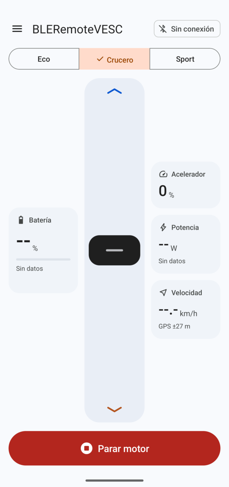
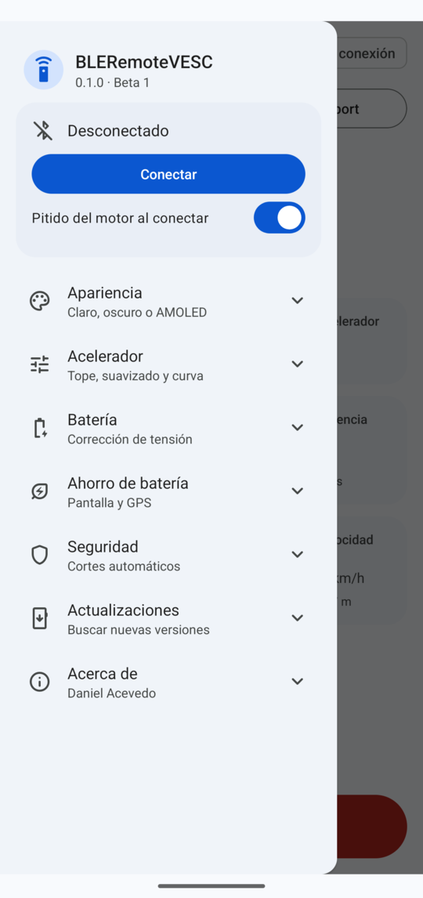
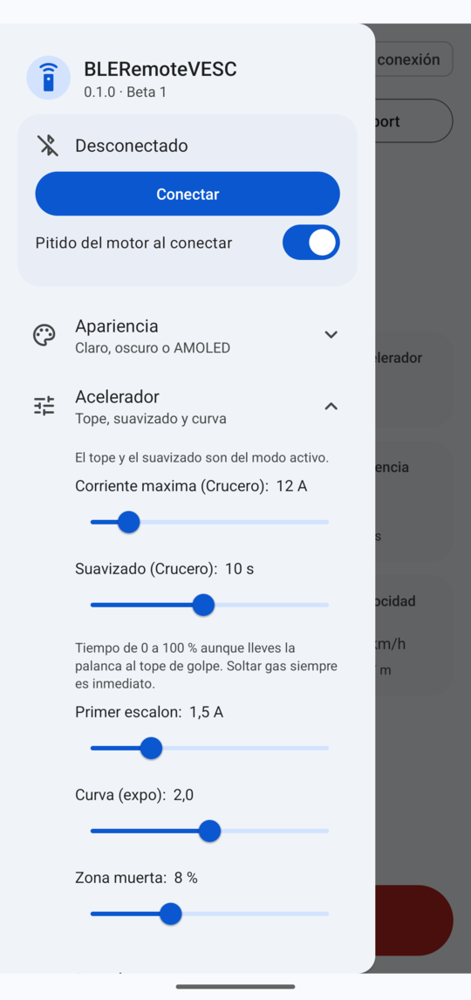

# BLERemoteVESC — Bluetooth throttle for VESC-powered float tubes

**English** · [Español](README.es.md)

> 🧪 **Beta.** It works on the water, but it is young software controlling a motor. Test it on land first, keep the motor's kill switch within reach, and if you find a bug please [open an issue](https://github.com/Danii204/BLERemoteVESC/issues) describing what you were doing.

An Android app that turns your phone into the throttle of an electric motor driven by a [VESC](https://vesc-project.com/)-based controller, connected over Bluetooth Low Energy. It was built for a **fishing float tube (belly boat)** with an inrunner motor: one large vertical throttle you can operate without looking, three power modes, live battery, power and speed readouts, and several layers of protection against accidental throttle.

<p align="center">
  
  
  
</p>

## Features

- **Vertical throttle with a centre detent.** Up is forward, down is reverse. It only moves when you grab the handle, it takes a deliberate drag to leave neutral, and it snaps back to neutral with a haptic tick.
- **Torque control.** The app sends motor current (`COMM_SET_CURRENT`), not duty cycle: starts are gentle and the response in the water is progressive.
- **Power modes** — Eco, Cruise and Sport, each with its own current limit and acceleration ramp.
- **Live data from the VESC**: battery percentage and voltage, estimated remaining time at the current consumption, power drawn from the battery (W) and battery current.
- **Speed from the phone's GPS**, filtered so it only shows a value when the fix is accurate enough.
- **Heading from GPS** (course over ground) with a small compass rose. It does not use the phone's compass: on a float tube you sit facing backwards, so the compass would read the opposite. Works above 2 km/h; when stopped it shows the last heading, dimmed.
- **Beep on connect**: the motor itself plays two short tones when the link is established.
- **Light, dark and AMOLED themes** (Material 3). AMOLED uses pure black to save battery on OLED screens.
- **Battery-friendly**: GPS only while the app is in the foreground, screen kept on only while connected, optional dimming after 30 s without touching, adaptive Bluetooth traffic.
- **Updates from GitHub Releases**, verified with SHA-256, installed with one tap.

> The user interface is currently in **Spanish**.

## Hardware

This is the setup the app was developed and tested with. Any VESC-based controller with a BLE UART module (Nordic UART Service) should work; the motor and battery settings below are specific to this hardware.

| Part | Model |
| --- | --- |
| Controller | Flipsky FSESC 75100 Pro, aluminium case, with its BLE module (advertises as `VESC BLE UART`) |
| Motor | Flipsky 65121, 130 KV inrunner, sensorless, sealed |
| Battery | 10S8P Li-ion NMC (21700 cells), 40 Ah, with a Daly smart BMS |
| Phone | Android 8.0 or newer with Bluetooth LE |

## Install

1. Download `BLERemoteVESC.apk` from the latest [release](https://github.com/Danii204/BLERemoteVESC/releases). Each release also publishes the file's SHA-256.
2. Open it. Android will ask you to allow installing apps from your browser or file manager the first time.
3. Open **BLERemoteVESC**, accept the Bluetooth and location permissions (location is needed for the GPS speed, and by Android 11 and older for Bluetooth scanning).
4. Tap **☰ → Conectar**. The app finds the controller by its Bluetooth service, no pairing needed.

> Do not try to pair the controller from the Android or desktop Bluetooth settings: the BLE module has no pairing and the system will report that it "cannot connect". That is expected; the app connects directly.

## Usage

| Action | How |
| --- | --- |
| Connect / disconnect | ☰ → **Conectar** |
| Accelerate forward / in reverse | Grab the throttle handle and drag it up / down past the detent |
| Back to neutral | Drag the handle to the centre; it snaps in with a vibration |
| Stop | **Parar motor** (instant, also resets the throttle) |
| Change power mode | **Eco · Crucero · Sport** at the top, also while moving |
| Settings | ☰ (top left), sections expand when tapped |

The throttle is greyed out and does not move until the app is connected to the controller.

### Power modes

| Mode | Current limit | 0 → 100 % ramp |
| --- | --- | --- |
| Eco | 6 A | 15 s |
| Crucero (Cruise) | 12 A | 10 s |
| Sport | 25 A | 5 s |

Both values can be changed per mode in ☰ → **Acelerador**. Switching to a mode with a lower limit reduces thrust immediately; switching to a higher one ramps up.

### Settings

- **Apariencia** — light, dark or AMOLED.
- **Acelerador** — current limit and ramp of the active mode, first step current, response curve (expo) and centre dead band.
- **Batería** — voltage correction, to match the reading of your BMS app (see [Battery reading](#battery-reading)).
- **Ahorro de batería** — dim the screen after 30 s, turn GPS speed off.
- **Seguridad** — stop the motor when the app goes to the background (on by default).
- **Actualizaciones** — check for updates now, or automatically every 12 h.
- **Acerca de** — version, author and licence.

## Safety

The app is designed so that an accidental touch cannot start the motor, and so that every failure ends with the motor stopped:

- **Throttle locked** until the controller is connected.
- **Grab to move.** Touching the throttle track anywhere other than the handle does nothing.
- **Hard detent.** Leaving neutral requires dragging past 20 % of the travel; crossing from forward to reverse in one movement stops at neutral.
- **Acceleration ramp** (5–15 s depending on the mode), even if the handle is pushed to the end at once. **Releasing is always instant.**
- **Link loss.** The app refreshes the command at 4–10 Hz; the VESC stops the motor on its own if no command arrives for 1 s (phone off, out of range, app frozen).
- **Background.** By default the motor stops when the app leaves the screen.

> ⚠️ This is a hobby project, not a certified marine product. You use it at your own risk. Test on land with the propeller removed before going on the water, never rely on the app as your only way to stop the motor, and wear a life jacket.

## VESC configuration

These are the settings used with the hardware above. Use them as a reference; your hardware may need different values.

### ⚠️ FSESC 75100 / 75200: disable the phase filters first

Flipsky ships these controllers with the `75_300_R2` firmware, which reports hardware phase filters that the board **does not have**. With firmware 5.3 or newer, set

`Motor Settings → FOC → Filters → Enable Phase Filters = False`

and write the configuration **before running motor detection**. Running detection with the filters enabled can destroy the controller (a measured resistance of about 1 mΩ is the typical symptom). The option is re-enabled by every firmware flash and by restoring defaults.

### Steps

1. **Firmware** must match the VESC Tool version, otherwise VESC Tool runs in *limited mode*. Flash over USB, never over Bluetooth.
2. **Phase filters off** (see above).
3. **Motor detection** with the FOC wizard, propeller removed and motor clamped: *Generic* usage, *Large Inrunner*, battery data, *Direct drive*, motor temperature sensor *Disabled* (the 65121 has none).
4. **Motor poles.** Detection does not measure them. Derive them from the measured flux linkage λ and the nameplate KV: `KV = 60 / (√3 · 2π · λ · pole_pairs)`. For the 65121, λ = 14.1 mWb gives 130 KV with **3 pole pairs (6 poles)**. Set it in `Motor Settings → Additional Info → Setup`.
5. **Limits, sensorless start and app settings** as in the table below.

| Setting | Value | Why |
| --- | --- | --- |
| Motor Current Max / Brake | 50 A / −30 A | |
| Absolute Maximum Current | 150 A | Detection on firmware 6+ leaves it too low (Flipsky recommends 150–250 A for the 75100) |
| Battery Current Max / Regen | 50 A / −10 A | Leaves margin under the 60 A breaker and BMS |
| Battery Voltage Cutoff Start / End | 34.0 V / 31.0 V | 10S; 1 V above nominal because this firmware misreads the voltage by 0.5–1 V |
| Battery Voltage Regen Cutoff Start / End | 41.5 V / 42.5 V | Prevents overcharging a full pack while braking |
| MOSFET Temp Cutoff Start / End | 80 °C / 100 °C | |
| Zero Vector Frequency | 30 kHz | Quietest; it is already the default for this firmware |
| Observer | MXLEMMING lambda comp. | Default, good at low speed |
| Sensorless openloop | *Propeller* preset, Current Boost 6 A | The boost fixed intermittent starts with the rotor in some positions |
| App to Use | UART | |
| Timeout / Timeout Brake Current | 1000 ms / 0 A | Stops after 1 s without commands, coasting instead of braking |
| Shutdown Mode | Always on | So it does not switch off while drifting |

Measured on the 65121 (with cable and connectors): R = 55.3 mΩ, L = 67.07 µH, Lq − Ld = 43.1 µH, λ = 14.107 mWb, observer gain 5.02.

### Battery reading

The battery percentage is computed from the bus voltage reported by the VESC using a Li-ion NMC open-circuit-voltage curve (0 % = 3.00 V and 100 % = 4.15 V per cell, the same limits as the Daly BMS). Two things to know:

- The percentage drops while accelerating and recovers when you release, because the voltage sags under load.
- The `75_300_R2` firmware reads the voltage slightly off. Compare with your BMS app at rest and set **Batería → Corrección de tensión** until both show the same voltage.

Power is `bus voltage × battery current`, both as reported by the VESC. The VESC has no current sensor on its input; it estimates the battery current from the phase currents it measures. The BMS current reading is the more accurate of the two.

## How it works

- **Bluetooth.** The controller's BLE module exposes the Nordic UART Service (`6e400001-b5a3-f393-e0a9-e50e24dcca9e`, TX `…0002`, RX `…0003`) and forwards bytes to the VESC UART. The app writes standard VESC packets: `0x02 | len | payload | CRC16 | 0x03`, with CRC-16/XMODEM over the payload.
- **Commands.** `COMM_SET_CURRENT` at 10 Hz while moving and 4 Hz at rest; `COMM_GET_VALUES` at 5 Hz / 1 Hz for telemetry. With the default 23-byte MTU only 20 bytes fit in each write, so longer packets are split and sent back to back, and responses arriving in several notifications are reassembled and CRC-checked.
- **Beep.** The motor beep is a LispBM expression (`foc-beep`) sent with `COMM_LISP_REPL_CMD`, available on VESC firmware 6.00 and newer.

## Updates

When a newer version is published, the app shows a dot on the menu button and an **Actualizar** button under ☰ → **Actualizaciones**. It downloads the APK, checks its SHA-256 against the one published in the release, and hands it to the Android installer.

The app checks the [Releases](https://github.com/Danii204/BLERemoteVESC/releases) page at most every 12 hours when it opens (during the beta, pre-releases are included). The automatic check can be turned off. Android only accepts an update signed with the same key as the installed version.

## Privacy

- **No data is collected or sent.** No telemetry, analytics or accounts.
- The only Internet connection is an anonymous request to `api.github.com` to check for new versions, plus the download of the APK if you accept an update.
- Location is used only on the phone to compute speed, and only while the app is on screen.

## Building from source

Requirements: JDK 17 or newer and the Android SDK (platform 34).

```bash
./gradlew assembleDebug
```

The APK is written to `app/build/outputs/apk/debug/`. Release builds are signed with a key that is not part of this repository; `assembleRelease` reads it from `~/.gradle/gradle.properties` (`BLEREMOTEVESC_STORE_FILE`, `BLEREMOTEVESC_STORE_PASSWORD`, `BLEREMOTEVESC_KEY_ALIAS`, `BLEREMOTEVESC_KEY_PASSWORD`).

```
app/src/main/java/xyz/danilab/bleremotevesc/
├── MainActivity.kt    UI, throttle logic, modes, GPS, power saving
├── ThrottleView.kt    Vertical throttle with detent and grab-only handle
├── VescBle.kt         BLE client for the Nordic UART Service, write queue
├── VescPacket.kt      VESC packet framing and commands
├── VescTelemetry.kt   Frame reassembly, COMM_GET_VALUES parsing, battery curve
├── Updater.kt         GitHub Releases check, download and SHA-256 verification
└── Palette.kt         Light, dark and AMOLED colour schemes
```

## Licence

[GPL-3.0](LICENSE). You may use, modify and redistribute it; distributed modified versions must keep the same licence and publish their source code.

Made by **Daniel Acevedo** · [danilab.xyz](https://www.danilab.xyz)

*VESC is a trademark of Benjamin Vedder. Flipsky and Daly are trademarks of their respective owners. This project is not affiliated with or endorsed by any of them.*
